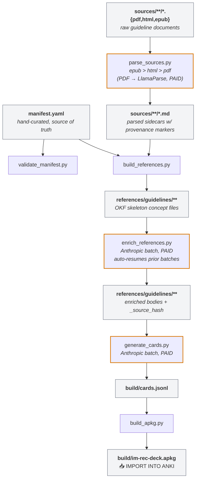

# IMRecDeck

An internal-medicine recommendation deck — a pipeline that turns a curated catalog of clinical practice guidelines into an importable Anki deck.

🌐 **Browse the manifest:** <https://cfu288.github.io/im-rec-deck/>

> [!NOTE]
> This repo is an experiment to see if I can utilize AI agents to help me stay up to date on medical guidelines by automatically parsing them and building out an Anki deck. I don't pretend to have manually curated any of this. This blurb here is probably the only thing written by a human in this repo. Use at your own risk. Copyrighted material is not included in this repo - you'll need to source that yourself.

## What it produces

`build/im-rec-deck.apkg` — a self-contained Anki package containing:

- A custom `GuidelinesCloze` notetype (7 fields: Text, Back Extra, Source, System, Topic, Society, Year)
- Cloze cards extracted from each enriched guideline body
- Hierarchical deck tree (`IMRecDeck::<System>::<Topic> (<Year> <Society>)`) — tap-into one guideline at a time on mobile, study the parent for the unified queue
- Namespaced tags under a single root: `im-rec-deck::system::<slug>`, `im-rec-deck::topic::<slug>`, `im-rec-deck::society::<slug>`, `im-rec-deck::year::<n>`, `im-rec-deck::status::superseded`, `im-rec-deck::high-yield`
- A styled card template
- Stable GUIDs derived from the manifest key, so re-importing future regenerations updates existing notes in place (preserves FSRS review history)

Import via Anki → `File → Import` → select `build/im-rec-deck.apkg`.

## Pipeline at a glance



## Quickstart

```bash
# One-time: drop guideline PDFs/EPUBs/HTMLs into sources/<system>/<topic>/.
# Add corresponding entries to manifest.yaml.

# Local-only, idempotent — run any time:
just all-local             # validate, parse, build skeleton, report, repackage apkg
                           # NOTE: `parse` may hit LlamaParse (paid) for PDF sources
                           # that have no EPUB/HTML alternative — see `just parse`
                           # for details.

# Explicit Anthropic-paid steps — run when you mean to spend:
just enrich                # ~$10 for a full run on ~100 concepts
just cards                 # ~$1.50 for ~1500 cards
just apkg                  # re-package — instant, free

# Then import build/im-rec-deck.apkg in Anki.
```

`just` (run with no args) lists every target with its docstring.

## Key invariants

1. **`manifest.yaml` is the only thing you edit by hand** (plus dropping source documents into `sources/`).
1. **`references/`, `build/`, and any `.md` under `sources/`** are 100% generated. Don't edit them — they'll get overwritten.
1. **Idempotency at every step.** Re-running anything is safe and cheap if nothing changed; only diffs trigger API spend.
1. **Cards have stable GUIDs.** Re-importing a regenerated `.apkg` updates existing notes in place; Anki preserves your review history.
1. **`high_yield: true` on a topic** drives the `high-yield` card tag AND the auto-derived study guide. Single source of truth.

## Repo layout

```
manifest.yaml                 # the catalog — source of truth
sources/                      # raw guideline documents + parsed .md sidecars
references/guidelines/        # generated OKF bundle (skeleton + enriched bodies)
build/                        # generated artifacts (gitignored; .apkg, .jsonl, state files)
scripts/                      # the pipeline (uv-runnable)
spec/                         # conventions + architecture review + cloze rules
.claude/                      # hooks (manifest validator, mdformat) + skills (parse-sources)
Justfile                      # task runner — `just` to list targets
```

## Where to read more

- `spec/architecture-review.md` — full data flow + script inventory + problem list
- `spec/conventions.md` — manifest schema conventions, high-yield flag semantics, format preference
- `spec/anki-apkg-pipeline.md` — apkg packaging details, GUID model, custom notetype design
- `spec/anki-cloze-cards-key-concepts.md` — cloze-card writing principles (Wozniak + AnKing)
- `manifest.yaml` (top comments) — manifest schema reference
